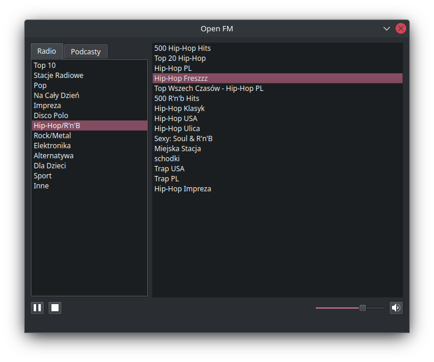

# openfm-qt

Qt client for Polish internet radio Open FM.

## GNU/Linux packages
### Arch Linux
Official package is available in AUR as [openfm-qt](https://aur.archlinux.org/packages/openfm-qt).

Install it using `yay` or other AUR helper.
```bash
$ yay -S openfm-qt
```

## Releases
To download latest version go to [releases](https://github.com/wzykubek/openfm-qt/releases).
> **_NOTE:_** Releases are currently suspended. You can download working one portable version for Windows or any Linux distro, but not the latest. Currently my main goal is to maintain AUR package and soon `.deb` and `.rpm` packages.

## Python package
You can manually install app as Python package using `pip`. Go to root project directory and use following command.
```bash
$ python -m pip install .
```

Alternatively use `pipx` to install app in virtual environment.
```bash
$ pipx install .
```

> **_NOTE:_** This option won't create desktop entry.

## Development
Use `poetry` tool to manage project dependencies and virtual environments.
```bash
$ poetry install # in root project directory
```

Run application.
```bash
$ poetry run openfm-qt
```

## Screenshots

